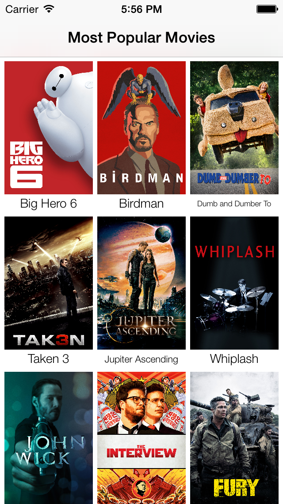

# movie-app-themoviedb-prototype
Simple prototype for themoviedb.org 

Application display a list of the latest most popular movies and allow the user to get more information about each one of them. The application will display the movies in a list. When the user selects a movie from that list, the movie details are displayed.
Coding done using AFNetworking, CocoaPods, and the couple asynchronous unit tests included. No third party wrapping libraries (for movieDB) are used.

  

